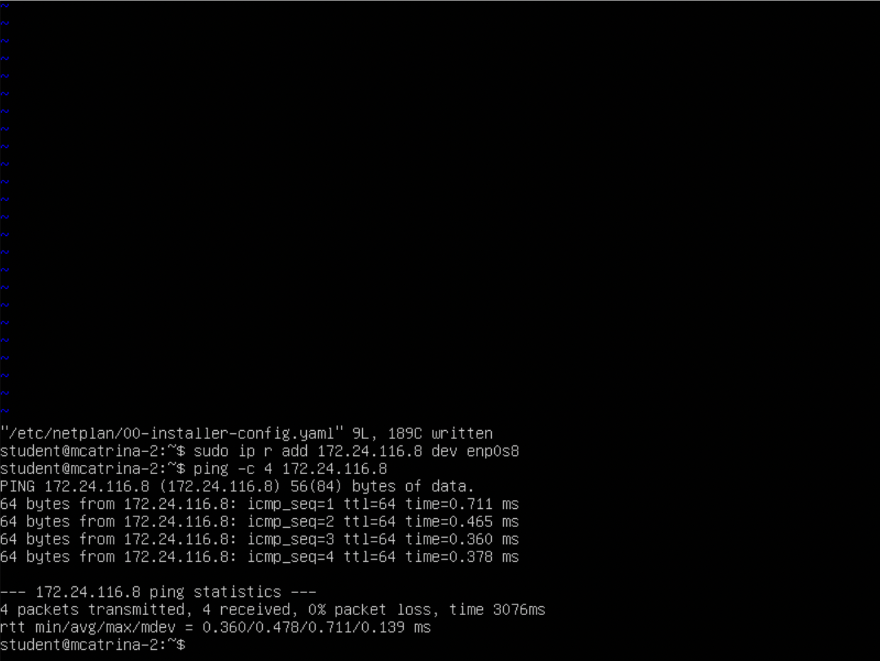
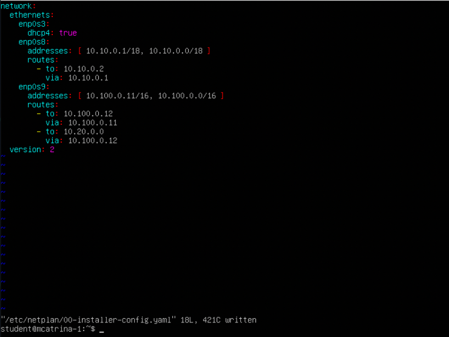
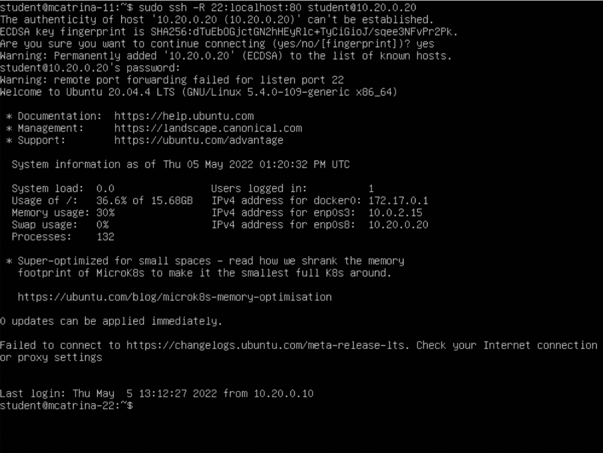

## Part 1. Инструмент **ipcalc**
- `sudo apt install ipcalc`
#### 1.1. Сети и маски

##### 1) Адрес сети 

- **192.167.38.54/13**:
  + **192.167.38.54**

##### 2) Перевод маски

- **255.255.255.0**:
  + **/24**
  + **11111111.11111111.11111111.00000000**
- 
- **/15**:
  + **255.254.0.0**
  + **11111111.11111110.00000000.00000000**
- 
- **11111111.11111111.11111111.11110000**:
  + **255.255.255.240**
  + **/28**
##### 3) Минимальный и максимальный хост в сети 

**12.167.38.4**:
- 
- **/8**:
  + **12.0.0.1** | **12.255.255.254**
- 
- **11111111.11111111.00000000.00000000**:
  + **12.167.0.1** | **12.167.255.254**
- 
- **255.255.254.0**:
  + **12.167.38.1** | **12.167.39.254**
- 
- **/4**:
  + **0.0.0.1** | **15.255.255.254**

#### 1.2. localhost

- **194.34.23.100/16** - Class C
- **127.0.0.2/24** - localhost
- **127.1.0.1/8** - localhost
- **128.0.0.1/8** - localhost
#### 1.3. Диапазоны и сегменты сетей
##### 1) 
- **10.0.0.45/8** - Приватный
- **134.43.0.2/16** - Публичный
- **192.168.4.2/16** - Приватный
- **172.20.250.4/12** - Приватный
- **172.0.2.1/12** - Публичный
- **192.172.0.1/12** - Приватный
- **172.68.0.2/12** - Публичный
- **172.16.255.255/12** - Приватный
- **10.10.10.10/8** - Приватный
- **192.169.168.1/16** - Публичны1
##### 2) 

- **10.10.0.0/18**: 
  + **10.0.0.1** - нет
  + **10.10.0.2** - да
  + **10.10.10.10** - да 
  + **10.10.100.1** - нет
  + **10.10.1.255** - нет

## Part 2. Статическая маршрутизация между двумя машинами

##### `ip a`


##### `vim /etc/netplan/*.yaml`:


  + ws1 - **192.168.100.10**, маска **/16**, ws2 - **172.24.116.8**, маска **/12**
##### `netplan apply`


#### 2.1. Добавление статического маршрута вручную

- ws1 - `ip r add 172.24.116.8/32 via 192.168.100.10`
- ws2 - `ip r add 192.168.100.10/31 via 172.24.116.8`




#### 2.2. Добавление статического маршрута с сохранением

- `sudo vim etc/netplan/00-installer-config.yaml`
  + `sudo netplan apply`
  + `sudo reboot`


  + ws1 - `ping 172.24.116.8`
  + ws2 - `ping 192.168.100.10`


## Part 3. `sudo apt install iperf3`

#### 3.1. Скорость соединения
- ##### 8 Mbps = 1 MB/s
- ##### 100 MB/s = 800000 Kbps
- ##### 1 Gbps = 1000 Mbps


#### 3.2. Утилита **iperf3**
##### ws1 - `sudo iperf3 -c 172.24.116.8` и ws2 - `sudo iperf3 -s`


## Part 4. Сетевой экран

#### 4.1. `sudo apt-get install iptables`
- `sudo vim /etc/firewall.sh`


##### `sudo chmod +x /etc/firewall.sh` и `sudo /etc/firewall.sh`


  + ws1 - INPUT для пакетов на ping-reply DROP - не работает т.е. пакеты отправляет, но не принемает.
  + ws2 - INPUT для пакетов на ping-reply ACCEPT - работает.

#### 4.2. `sudo snap install nmap`

> подключить *nmap* к сетевому управлению:
```shell
  sudo snap connect nmap:network-control
```


## Part 5. Статическая маршрутизация сети

#### 5.1. Настройка адресов машин

##### Настроика конфигурации


##### `ip -4 a`


##### ping ws22 с ws21


##### ping r1 с ws11


#### 5.2. Включение переадресации IP-адресов.

- `sudo sysctl -w net.ipv4.ip_forward=1`


- `sudo vim /etc/sysctl.conf`


#### 5.3. Установка маршрута по-умолчанию

##### Настроика маршрута по-умолчанию (шлюз) для рабочих станций.


##### `ip r`


##### пинг ws11 - r2; `sudo tcpdump -tn -i enp0s8`


#### 5.4. Добавление статических маршрутов

##### r1 и r2 статические маршруты. 




##### `ip r`


##### ws11 - `ip r list 10.10.0.0/18` и `ip r list 0.0.0.0/0`


- для 10.10.0.0 выбран не 0.0.0.0/0 потому, что маршрутизатор выбирает путь с большей маской.

#### 5.5. `sudo apt install inetutils-traceroute`
##### на рабочих станциях перед установкой нужно отключать gateway4


  
  + `traceroute 10.20.0.10`


  
  + r1 - `sudo tcpdump -tnv -i enp0s8`

- 1 - обращаемся к r1
- 2 - переадресация направлена на r2
- 3 - А с r2 уже по указанному адресу на w22

#### 5.6. Использование протокола **ICMP** при маршрутизации

- `sudo tcpdump -n -i enp0s8 icmp`


  
  + `ping -c 1 10.30.0.111`

## Part 6. Динамическая настройка IP с помощью **DHCP**

- `sudo vim /etc/dhcp/dhcpd.conf`

##### 1)


##### 2)


##### `sudo apt install isc-dhcp-server` 
##### `sudo systemctl restart isc-dhcp-server`
##### ws21 - `reboot`


  + `ip a`


  + `ping 10.20.0.20`


  + `ping 10.10.0.70`


##### ws21 обновление ip адреса


  + `dhclient -r`
  + `dhclient -v`


## Part 7. **NAT**

##### `sudo apt install apache2` на ws22 и r2


##### `sudo service apache2 start` на ws22 и r2


#####  на r2 следующие правила:


##### ws22 и r1 `ping`
*При запуске файла с этими правилами, ws22 не должна "пинговаться" с r1*


##### Добавить в файл ещё одно правило:


##### ws22 и r1 `ping`
*При запуске файла с этими правилами, ws22 должна "пинговаться" с r1*


##### Добавить в файл ещё два правила:


  + `telnet 10.100.0.12 8080`

-

  + `telnet 10.100.0.11 8080`


## Part 8. Дополнительно. Знакомство с **SSH Tunnels**

##### ws22 - `sudo systemctl start apache2`


##### c ws21 до ws22 - `sudo ssh -L 22:localhost:80 wsybil@10.20.0.20`


##### c ws11 до ws22 - `sudo ssh -R 22:localhost:80 wsybil@10.20.0.20`




